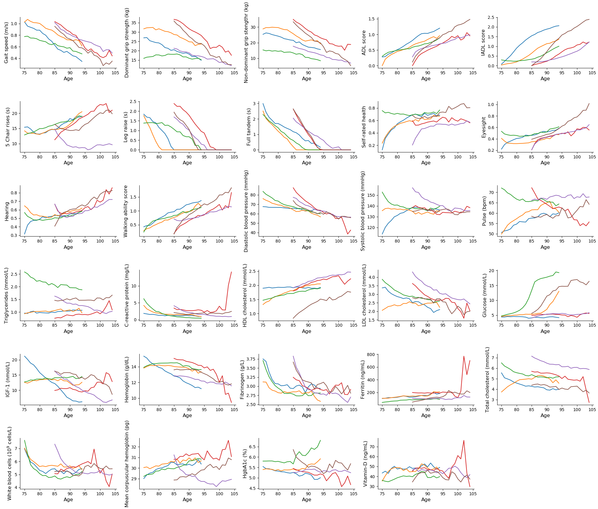

# DJIN aging model
The DJIN (Dynamic joint interpretable network) model of aging, from https://arxiv.org/abs/2105.03410. A diagram of this model is located in Model_Diagram/. The model using system of stochastic differential equations to model aging health trajectories and survival probability. SDEs are coupled by a network of interactions, allowing the coupling between health variabes to be interpreted with this interaction network. The model is trained with a variational bayesian approach.

# Documentation
The DJIN model is located in the Model/ directory, additionally we have included 3 alternate models in Alternate_models/, as well as Elastic net linear comparison models in Comparison_models/. Hyperparameters used to train the models are available in Output/. The parameters for the trained models are available in Parameters/.

After training the model with train.py, predict.py outputs predictions from the test set to Analysis_Data/. Then the plotting code in Plotting_code/ is used to generate plots. Plots are shown in Plots/.

# Requirements
The model requires pytorch, numpy, scipy, and pandas to run. Creating datasets additionally requires pyreadstat, plotting requires matplotlib and seaborn, and lienar comparison models require scikit-learn and lifelines. The code was originally run with pytorch 1.8.1, numpy 1.19.5, scikit-learn 0.24.1, and lifelines 0.25.8.

Additionally, requires a GPU and pytorch installed with cuda for reasonable runtimes. Alternatively the device in train.py will be set to CPU if no GPU is available, but the model will run extremely slow.

# Dataset
This model is trained with the ELSA dataset, which can be accessed here https://www.elsa-project.ac.uk/accessing-elsa-data by registering. 

After acquiring the dataset from https://www.elsa-project.ac.uk/accessing-elsa-data, the create_elsa_data.sh file in clean_elsa/ can be run to create the train, validation, and test data sets. (Requires setting the folder for the dataset in the individual files).

# Synthetic dataset
A synthetic dataset generated with this model is available at https://zenodo.org/record/4733386.

<p align="center"> 

</p>

# Demo
Running train_sample.py will train the model with some anonymized sample data for a small number of individuals (Data/train_sample.csv). After a 5-10 minutes of running for a few hundred epochs, running plot_sample.py with command line arguments "--epoch ###" will show the model fit on 4 individuals from the training set, which should roughly agree with the supplied plot sample_plot.pdf.  

Running split_data.py with command line arguments "--dataset sample" will generate train,validate,test sets for a sample dataset Data/sample_data.csv as well.

# Citation
Please cite the preprint if you find this work useful (https://arxiv.org/abs/2105.03410).
```
@misc{farrell2021interpretable,
      title={Interpretable machine learning for high-dimensional trajectories of aging health}, 
      author={Spencer Farrell and Arnold Mitnitski and Kenneth Rockwood and Andrew Rutenberg},
      year={2021},
      eprint={2105.03410},
      archivePrefix={arXiv},
      primaryClass={q-bio.QM}
}
```